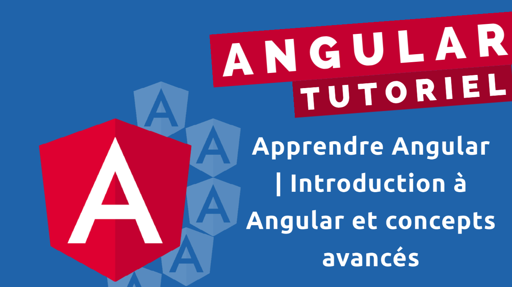

# Coulisses tech

Application de la serie de tutoriels   
[Apprendre Angular | Introduction à Angular et concepts avancés](https://www.youtube.com/playlist?list=PLrbLGOB571zeR7FUQifKmjUpT4ImldCPt)

## Usage: 

- Téléchager le code 
- Installer les dépendences avec `npm install`
- Démarrer l'application avec `npm run start`

